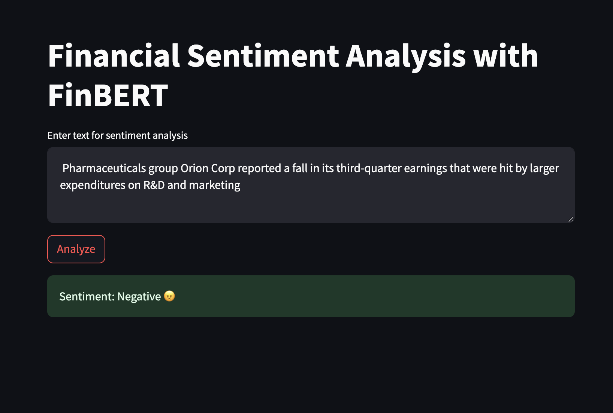

# FinBert_Fine_Tunning_App
     


## Overview
The project consists of a Jupyter notebook where a classification algorithm is developed to determine the quality of wine based on certain wine characteristics. Additionally, an application is built where the user can obtain a summary according to the pages assigned from the following nutrition book: https://pressbooks.oer.hawaii.edu/humannutrition2/ 
<p align="center">
  
</p>

## Setup Instructions
1. Clone the Repository:
    ```html
    git clone https://github.com/despinoza119/FinBert_Fine_Tunning_App.git
    ```

2. Copy the .joblib file in the project folder
    ```html
    Link to drive: 
    ```

3. Build the docker image:
    ```html
    docker build -t finbert_test .
    ```

4. Run the docker image builded:
    ```html
    docker run -p 8501:8501 finbert_test
    ```

5. To visualize the app go to http://localhost:8501 :
    ```html
    http://localhost:8501
    ```

## Documentation

## License
MIT License